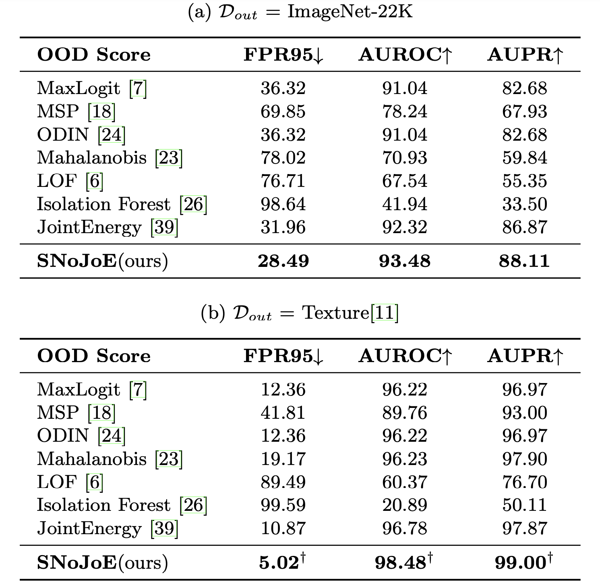

# Multi-Label Out-of-Distribution Detection with Spectral Normalized Joint Energy

This is a [PyTorch](http://pytorch.org) implementation of [Multi-Label Out-of-Distribution Detection with Spectral Normalized Joint Energy](......) by Yihan Mei, Xinyu Wang, Dell Zhang, Xiaoling Wang.
Code is modified from [JointEnergy][https://github.com/deeplearning-wisc/multi-label-ood], [ODIN](https://github.com/facebookresearch/odin),  [Outlier Exposure](https://github.com/hendrycks/outlier-exposure), and [deep Mahalanobis
detector](https://github.com/pokaxpoka/deep_Mahalanobis_detector).

## Datasets

Our experimental configuration of in-distribution and out-of-distribution datasets are identical with [JointEnergy][https://github.com/deeplearning-wisc/multi-label-ood].

Put PASCAL-VOC under ./Pascal folder, and put Texture under ./dtd folder.

## Training the models

Train the resnet model for PASCAL-VOC dataset

`python train.py --arch resnet101 --dataset pascal --save_dir ./save_models/`

## OoD Detection

To reproduce the SNoJoE score for PASCAL-VOC dataset, please run: 

`python eval.py --arch resnet101 --dataset pascal --ood_data imagenet --ood energy --method sum`

## OoD Detection Result

OoD detection performance comparison using SNoJoE vs. competitive
baselines.




## Citation

```

```

